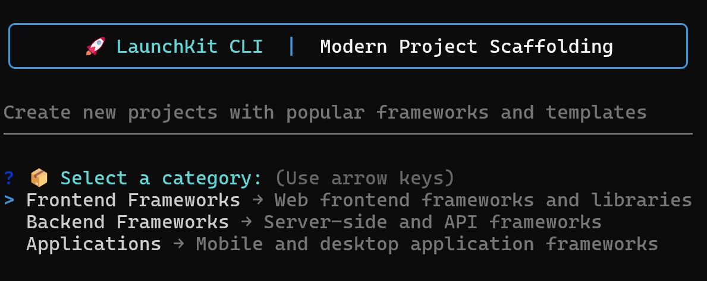
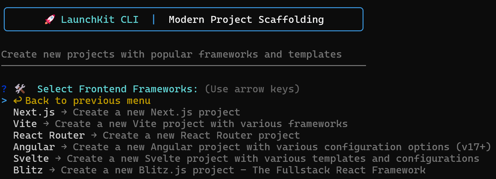
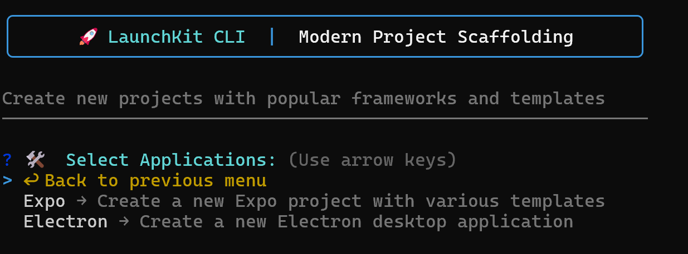
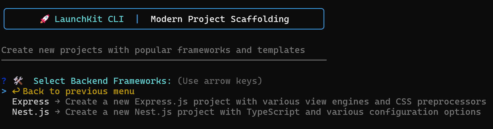

# Project LaunchKit

[](https://github.com/TheRealPerson98/LaunchKit-CLI/blob/main/LICENSE)
[](https://www.npmjs.com/package/project-launchkit)
[](https://github.com/TheRealPerson98/LaunchKit-CLI/actions)


An interactive CLI tool for quickly creating new projects with various frameworks and templates.

<p align="center">
  
</p>

## Screenshots

<p align="center">
  
  <br><br>
  
  <br><br>
  
</p>

## Features

- 🚀 Quick project initialization
- 📱 Multiple framework support
- ⚡ Interactive CLI interface
- 🎨 Beautiful terminal UI
- ✨ Extensive template options
- 🛠️ Customizable configurations

## Requirements

- Node.js >= 16.x
- npm >= 7.x

## Installation

```bash
# Global installation
npm install -g project-launchkit

# Or run directly with npx
npx project-launchkit
```

## Usage

```bash
# Start the interactive CLI
launchkit

# Or with npx
npx project-launchkit
```

## Supported Templates

### Expo
- Default (TypeScript enabled)
- Blank
- Blank TypeScript
- Tabs Navigation
- Bare Minimum

### Next.js
- Default (Latest features)

### Electron
- Default (Vanilla JavaScript)
- Webpack
- Webpack + TypeScript
- Vite
- Vite + TypeScript

### Vite
- Vanilla JavaScript
- Vanilla TypeScript
- Vue.js
- Vue.js + TypeScript
- React
- React + TypeScript
- React + SWC
- React + SWC + TypeScript
- Preact
- Preact + TypeScript
- Lit
- Lit + TypeScript
- Svelte
- Svelte + TypeScript
- Solid
- Solid + TypeScript
- Qwik
- Qwik + TypeScript

### React Router
- Default template

### Express.js
- Default (Jade/Pug)
- EJS template
- Handlebars template
- Pug template
- No view (API mode)
- EJS + Sass
- Pug + Stylus
- Handlebars + Less

### Nest.js
- Default (TypeScript)
- Strict mode
- Skip Git
- Skip Install
- With npm
- With yarn
- With pnpm

### Angular
- Default (Standalone)
- With Routing
- With SCSS
- With NgModules
- Minimal setup
- Strict mode
- Complete setup

### Svelte
- Default template
- SvelteKit
- TypeScript
- Minimal
- Demo content

### Blitz.js
- Default template
- TypeScript
- JavaScript
- Minimal
- No Git

## Development

```bash
# Clone the repository
git clone https://github.com/TheRealPerson98/LaunchKit-CLI.git
cd LaunchKit-CLI

# Install dependencies
npm install

# Run in development mode
npm run dev

# Build the project
npm run build

# Run the built version
npm start
```

## Testing and Quality Assurance

```bash
# Run tests
npm test

# Run tests with coverage report
npm run test:coverage

# Run tests in watch mode
npm run test:watch

# Check linting
npm run lint

# Fix linting issues
npm run lint:fix

# Check for unused dependencies
npm run depcheck
```

## Project Structure

```
LaunchKit-CLI/
├── src/           # Source code
│   ├── config/    # Template configurations
│   ├── types/     # TypeScript types
│   └── utils/     # Utility functions
├── __test__/      # Test files
├── dist/          # Compiled output (generated)
└── coverage/      # Test coverage reports (generated)
```

## Contributing

### Prerequisites
Before submitting a pull request, ensure:
1. All tests pass (`npm test`)
2. Code coverage meets thresholds (`npm run test:coverage`)
3. No linting errors exist (`npm run lint`)
4. No unused dependencies (`npm run depcheck`)
5. TypeScript compiles successfully (`npm run build`)

### Steps to Contribute
1. Fork the repository
2. Create your feature branch (`git checkout -b feature/amazing-feature`)
3. Make your changes
4. Run the quality checks:
   ```bash
   npm run build        # Ensure it builds
   npm test            # Run all tests
   npm run lint        # Check code style
   npm run depcheck    # Check dependencies
   ```
5. Commit your changes (`git commit -m 'Add some amazing feature'`)
6. Push to the branch (`git push origin feature/amazing-feature`)
7. Open a Pull Request

### Code Quality Requirements
- Maintain test coverage above 80%
- Follow the existing code style
- Include tests for new features
- Update documentation as needed
- Keep dependencies minimal and up-to-date

## License

This project is licensed under the Apache License 2.0 - see the [LICENSE](LICENSE) file for details.

## Acknowledgments

- [Expo](https://expo.dev/)
- [Next.js](https://nextjs.org/)
- [Electron](https://www.electronjs.org/)
- [Vite](https://vitejs.dev/)
- [React Router](https://reactrouter.com/)
- [Express](https://expressjs.com/)
- [Nest.js](https://nestjs.com/)
- [Angular](https://angular.io/)
- [Svelte](https://svelte.dev/)
- [Blitz.js](https://blitzjs.com/)
- [Inquirer.js](https://github.com/SBoudrias/Inquirer.js/)

## Status

[](https://github.com/TheRealPerson98/LaunchKit-CLI/issues)
[](https://github.com/TheRealPerson98/LaunchKit-CLI/stargazers)
[](https://github.com/TheRealPerson98/LaunchKit-CLI/network) 